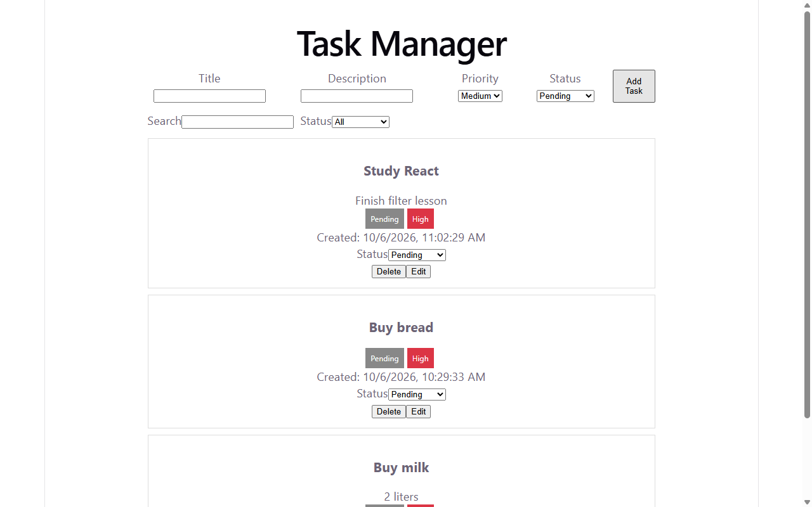
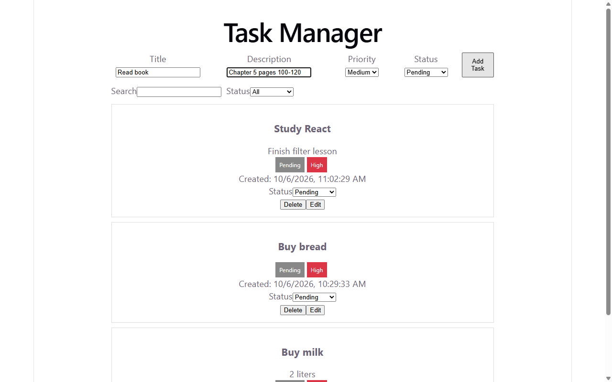
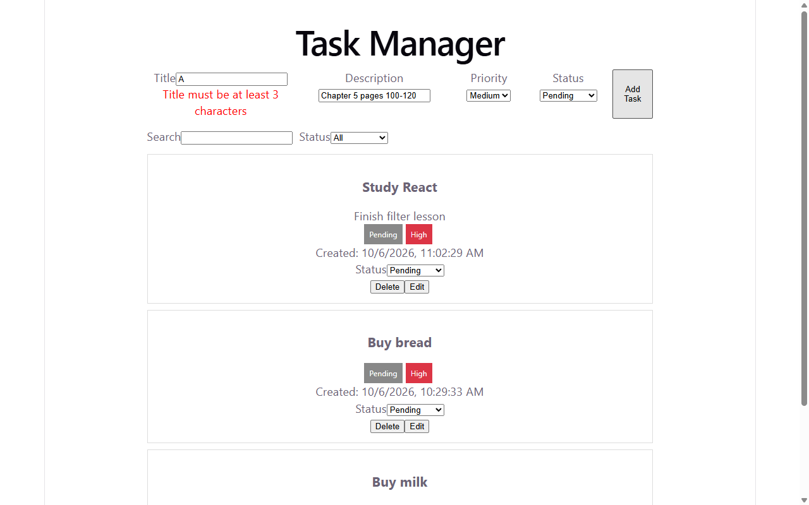
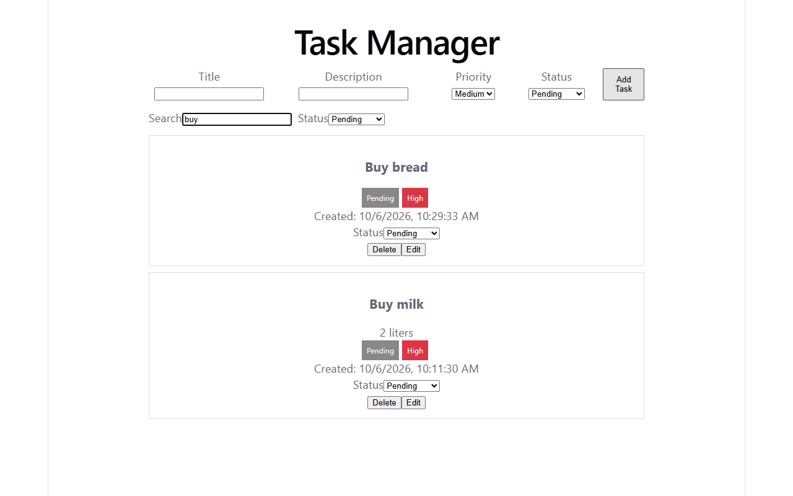
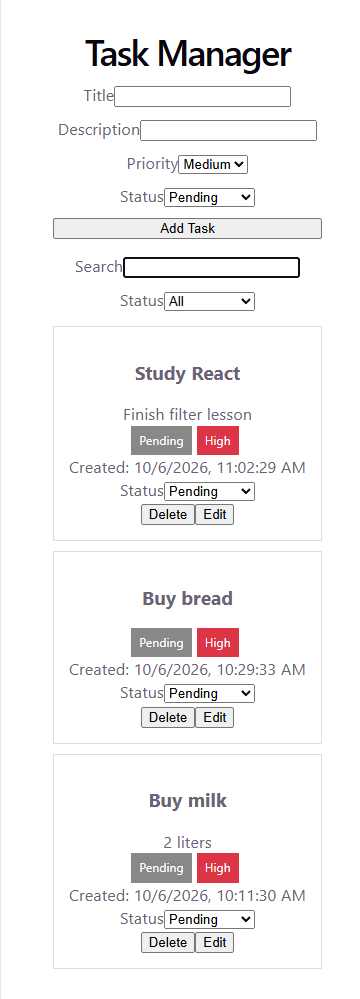

# Task Manager

A simple web app to make, see, change, and remove daily tasks.

You can add a task with title, description, status, and priority. You can search by title, filter by status, change status fast, edit full task, and delete with confirm.

## Tech Stack

* MongoDB Atlas + Mongoose - saves tasks in cloud database
* Express + Node - makes the backend API
* React + Vite - shows the frontend pages
* Axios - sends requests from frontend to backend

## Features

* Show all tasks, newest first
* Add task with simple check (title must be 3+ letters)
* Edit task in same form (Add becomes Update)
* Delete task with confirm box
* Change status from dropdown (Pending / In Progress / Completed)
* Search by title and filter by status
* Friendly messages like `{ "message": "Title is needed" }`
* Simple CSS: centered page, task cards, color badges, phone friendly

## Folder Structure

```
task-manager/
  README.md
  server/
    server.js
    config/db.js
    models/Task.js
    controllers/taskController.js
    routes/taskRoutes.js
    middleware/errorHandler.js
    .env.example
  client/
    src/
      App.jsx
      api.js
      App.css
      components/
        TaskForm.jsx
        TaskList.jsx
        TaskItem.jsx
        FilterBar.jsx
    .env.example
```

## How to Run Locally

You need Node 22 and a free MongoDB Atlas account.

1. Start backend:
```powershell
Set-Location -LiteralPath "task-manager/server"
npm install
npm run dev
```
Open `http://localhost:5000/` - you see `{ "message": "Task API is running" }`.

2. Start frontend in a second terminal:
```powershell
Set-Location -LiteralPath "task-manager/client"
npm install
npm run dev
```
Open `http://localhost:5173/` - you see Task Manager.

## Environment Variables (names only)

No secrets are written here. Copy `.env.example` to `.env` and fill your own values.

Server (`server/.env`):
* `PORT`
* `MONGO_URI`
* `CLIENT_URL`

Client (`client/.env`):
* `VITE_API_URL`

## Database Schema (Task)

MongoDB makes `_id` for each task. That `_id` is our Task ID. `createdAt` and `updatedAt` are added by themselves.

| Field | Type | Rules |
| --- | --- | --- |
| title | String | needed, trim spaces, min 3, max 100 |
| description | String | not needed, max 500 |
| status | String | one of Pending, In Progress, Completed, default Pending |
| priority | String | one of Low, Medium, High, default Medium |
| createdAt | Date | auto |
| updatedAt | Date | auto |

## API Endpoints

Base for local is `http://localhost:5000`. All errors look like `{ "message": "friendly text" }`.

| Method | URL | Body | Good Response | Bad Response |
| --- | --- | --- | --- | --- |
| GET | `/` | none | 200 `{ "message": "Task API is running" }` | - |
| POST | `/api/tasks` | `{ title, description, status, priority }` | 201 new task | 400 `{ "message": "Title is needed" }` |
| GET | `/api/tasks` | none | 200 list, newest first | 500 `{ "message": "Something went wrong" }` |
| GET | `/api/tasks/:id` | none | 200 one task | 400 `{ "message": "Invalid task id" }`, 404 `{ "message": "Task not found" }` |
| PUT | `/api/tasks/:id` | `{ title, description, status, priority }` | 200 updated task | 400 invalid id or bad input, 404 not found |
| DELETE | `/api/tasks/:id` | none | 200 `{ "message": "Task deleted" }` | 400 invalid id, 404 not found |

Test with PowerShell:
```powershell
Invoke-RestMethod -Uri http://localhost:5000/api/tasks -Method Get
```

## Live Links

* Frontend (Vercel): `https://client-two-eta-60.vercel.app/`
* Backend (Render): `https://task-api-nurc.onrender.com/`
* Demo Video: `https://PASTE-YOUR-VIDEO-LINK-HERE`

## Screenshots


Task list with 3 tasks.


Add form filled with a sample task.


Red error for a 1-letter title.


Edit mode with Update Task button.


Search and status filter narrow the list.


Phone view at 375x812, full page.

## Challenges and Solutions

* Atlas blocked connection with IP whitelist error. I learned Atlas only opens for listed IPs. I added `0.0.0.0/0` for Render and my current IP for local in Network Access.
* Page loaded but showed no tasks with CORS error. The header had `...vercel.app/` with extra `/`. I learned browser needs exact match. I removed trailing `/` in `CLIENT_URL` and `VITE_API_URL` and trimmed `/` in code.
* Frontend asked `//tasks` and got 404. I learned `VITE_API_URL` must end with `/api`, not with `/`. I fixed env to `...onrender.com/api`.
* Update saved bad title. I learned `findByIdAndUpdate` skips rules by default. I added `{ new: true, runValidators: true }` so it returns new task and checks rules again.
